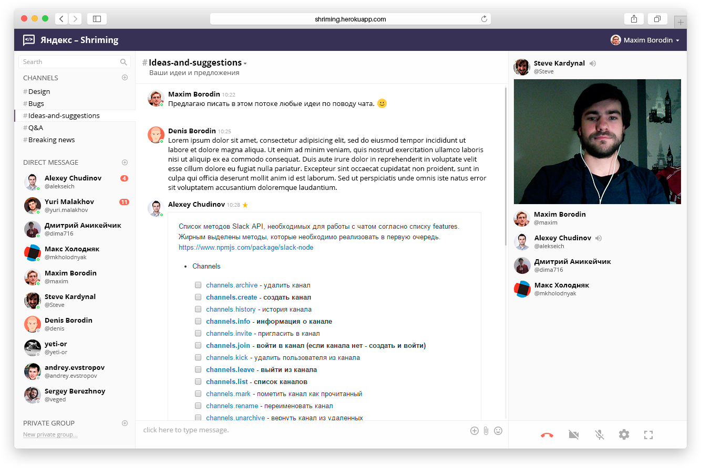

SHRIMING — Design
=================

Дизайн учебного проекта команды Shriming, разработанного в рамках [ШРИ'15 в Москве](https://academy.yandex.ru/events/shri/).

### Содержание
+ [shriming.psd](shriming.psd) — главный PSD макет
  + Приложение
    + Поп-апы
    + Окна
    + Экран видеозвонка
  + Сплеш скрин
+ [logo/](logo/) — Логотипы
+ [images/](images/) — Вся растровая графика чата
+ [favicon/](favicon/) — фавиконки

### Смайлы
[Twemoji](http://twitter.github.io/twemoji/) — Twitter Emoji (векторные смайлы и парсинг смайлов на стороне клиента)

### Шрифты
+ Open Sans — Основной шрифт
+ monospace — Для редактирования markdown

### Цвет
[Stylus переменные](https://github.com/shriming/chat/blob/master/frontend/common.blocks/variables/variables.styl)